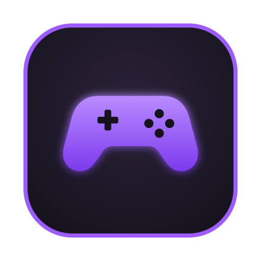
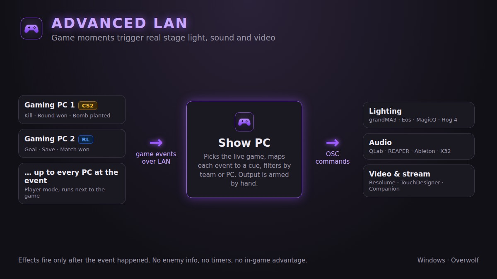
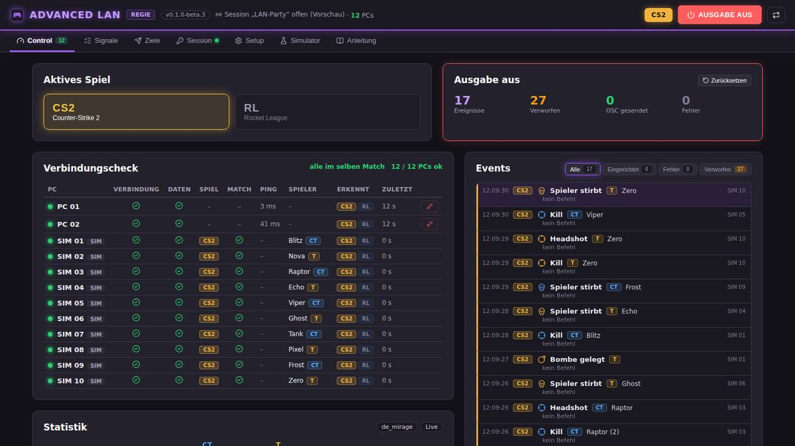
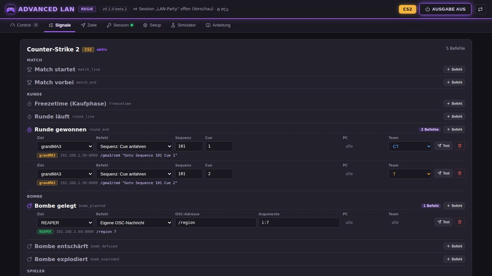
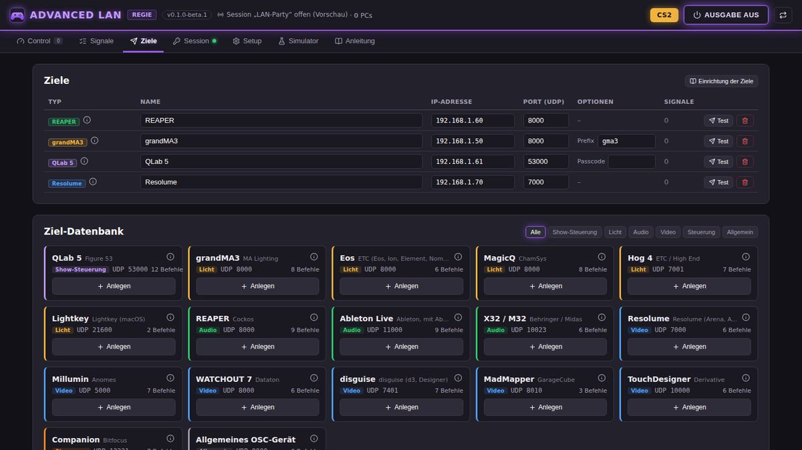
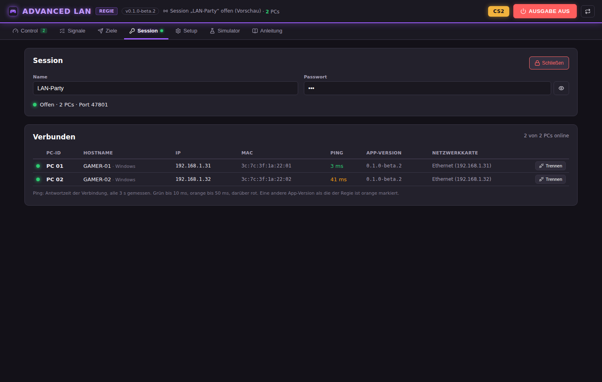
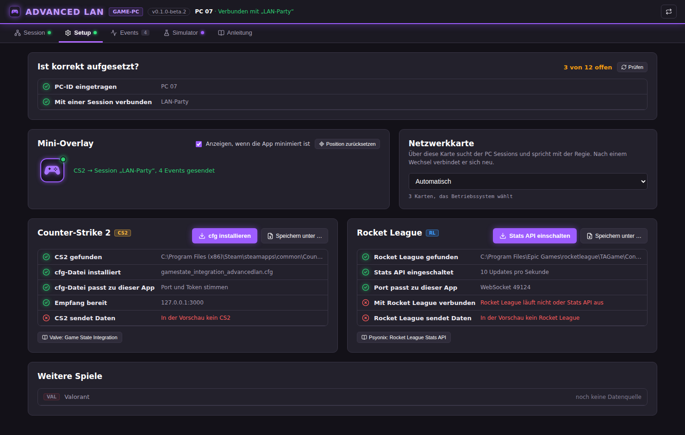
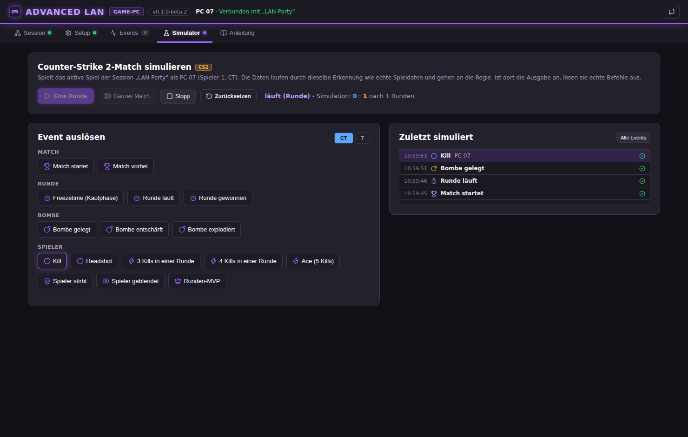
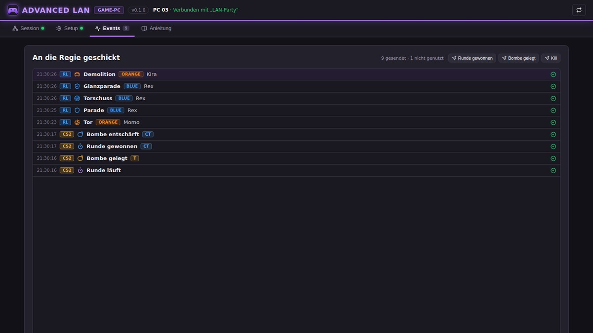
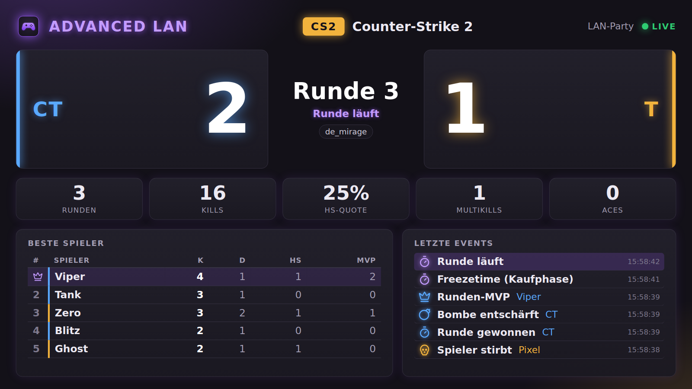

<p align="center">
  
</p>

<h1 align="center">Advanced LAN</h1>

<p align="center">Spielmomente lösen echtes Bühnenlicht, Ton und Video aus.<br>
<a href="https://github.com/Nomisimo/Advanced-Lan/releases">Download (Beta, macOS Intel)</a></p>

<p align="center"></p>

Eine App für die LAN-Party: Die Game-PCs melden Spielereignisse aus CS2, Rocket League, Dota 2, Overwatch 2, Rainbow Six Siege, Marvel Rivals, Fortnite, Apex Legends und PUBG, die Regie sendet daraus OSC-Befehle an Lichtpulte, Audio- und Videosoftware (z. B. grandMA3, QLab, Reaper, Resolume). Design und Aufbau wie [Netzwerkplaner](https://github.com/Nomisimo/Netzwerkplaner) und Stromplaner, Akzentfarbe Lila.

Gebaut mit **Overwolf Electron** (`@overwolf/ow-electron`), React 18 und esbuild. Die Oberfläche wird zu einer einzelnen Datei `dist-app/index.html` gebündelt.

## Drei Modi, eine App

| Modus | Läuft auf | Tabs |
|---|---|---|
| **Game-PC** | jedem PC, auf dem gespielt wird | Session (PC-ID, Sessions im Netz, beitreten), Setup (CS2, Dota 2 und Rocket League einrichten, Overwolf-Spiele, „Ist korrekt aufgesetzt?“-Check, Mini-Overlay, Netzwerkkarte), Events, Simulator (nur mit Session), Anleitung |
| **Regie** | dem Regie-PC (ohne Spiel) | Control (aktives Spiel, Ausgabe, Verbindungscheck, Statistik, Events), Signale, Ziele, Session (mit Übersicht: PC-ID, Hostname, IP, MAC, Ping, App-Version), Setup (genutzte Spiele, Check, Game-Stats-Screen, Netzwerkkarten), Simulator, Anleitung |
| **Standalone** | einem einzelnen PC: Regie und Spiel zusammen | wie die Regie, dazu Spiele (Setup der Spiele auf diesem PC wie beim Game-PC). Die Spiele melden direkt an die Regie, eine Session braucht es nur für zusätzliche Game-PCs |

Der Modus wird beim ersten Start gewählt (Standalone: Textknopf unten in der Mitte) und lässt sich oben rechts wechseln. Alle Erklärungen stehen im Tab „Anleitung“.

- Die Regie öffnet eine **Session mit Name und Passwort**. Game-PCs sehen alle Sessions im Netz automatisch per mDNS (Multicast, Dienst `_advancedlan._tcp`), auch mehrere Regien. Keine IP- oder Port-Eingabe.
- Verbindung per WebSocket (Port 47801, falls belegt ein freier, per mDNS angekündigt). Passwort per Challenge-Response mit HMAC-SHA256.
- Die PC-ID lässt sich nur ändern, solange der PC in keiner Session ist.
- Game-PCs melden immer alle Spiele, die die App kennt. Nur die Regie entscheidet: Im Tab „Setup“ werden die genutzten Spiele gewählt, im Tab „Control“ (und nur dort) das aktive Spiel. Events anderer Spiele werden verworfen.
- Mehrere PCs melden dieselbe Runde oder Bombe: die Regie wertet jedes Event nur einmal aus.
- Die Ausgabe ist nach jedem Start **aus** (roter Knopf). Erst „AUSGABE AN“ (grün, pulsierend) schickt OSC.
- Die Zähler im Control-Tab entsprechen den Filtern im Event-Log und lassen sich zurücksetzen. Der Verbindungscheck zeigt, ob alle PCs im selben Match sind (CS2: Map und Spielstand, alle anderen: Match-ID).

- **Mini-Overlay (Game-PC):** Ist die App minimiert, zeigt ein kleines App-Icon mit Statuspunkt über allen Fenstern, ob alles läuft (grün: Session und Spieldaten ok, orange: verbindet oder keine Spieldaten, rot: keine Session oder Fehler). Verschiebbar, Klick öffnet die App, abschaltbar im Tab „Setup“. Über exklusivem Vollbild erscheint es nicht (in CS2 „Vollbild (Fenster)“ nutzen).
- **Simulator auf dem Game-PC:** spielt mit verbundener Session das aktive Spiel der Regie, als liefe es auf diesem PC, und schickt die Events wirklich an die Regie.
- **Netzwerkkarten:** Die Regie wählt getrennt, über welche Karte sie Game-PCs empfängt und über welche sie OSC sendet, jedes Ziel kann eine eigene Karte haben; der Game-PC wählt seine Karte für die Session. Die App bindet Empfang bzw. Absender an die IP der Karte (eindeutig, wenn jede Karte in einem eigenen Subnetz liegt). Netzwerk-Anforderungen (IGMP, EEE, QoS …) stehen in der Anleitung.
- **Updates wie im Netzwerkplaner:** Die App prüft beim Start die GitHub-Releases und zeigt eine neuere Version als grünen Knopf neben der Versionsnummer. Mac: Klick lädt das DMG in den Download-Ordner und öffnet es, dann die App nach „Programme“ ziehen (unsigniert, deshalb kein Austausch im Hintergrund). Windows: `electron-updater` lädt und installiert selbst, sobald es Windows-Releases gibt. Klick auf die Versionsnummer öffnet „Was ist neu?“ (`src/core/version.js`, dort bei jeder Version die Änderungen eintragen).
- **Game-Stats-Screen (Regie, Standalone):** Spielstand, Runde oder Spielzeit, Zahlen des Matches, beste Spieler und letzte Events des aktiven Spiels, gestaltet für 1920×1080. Einschalten in Regie → Setup. Ausgabe als **Pop-out-Fenster** (Knopf „Stats“ in der Kopfzeile, Doppelklick = Vollbild) und/oder als **NDI-Quelle** mit eigenem Namen (30 fps, für OBS, vMix, NDI Studio Monitor). NDI rendert die Seite in einem unsichtbaren Offscreen-Fenster und schickt jedes Bild über [`@stagetimerio/grandiose`](https://github.com/stagetimerio/grandiose) (NDI SDK 6, Apache-2.0). Das Paket ist optional: Es lädt beim Installieren das NDI SDK von ndi.tv und baut sich mit node-gyp. Fehlt es, zeigt das Setup „NDI nicht verfügbar“, alles andere läuft. NDI® ist eine eingetragene Marke von Vizrt NDI AB.
- **Startanimation** wie im Netzwerkplaner: Controller, dessen Knöpfe nacheinander gedrückt werden.
- CS2, Rocket League und die Overwolf-Spiele gibt es als Game-PC nur unter Windows, Dota 2 auch auf dem Mac. Auf dem Mac läuft vor allem die Regie; der Game-PC-Modus meldet dort, welche Spiele fehlen.

## Spiele

| Spiel | Datenquelle | Teams | Simulator |
|---|---|---|---|
| Counter-Strike 2 | Valve Game State Integration | CT, T | 10 PCs, Runde |
| Rocket League | Psyonix Stats API | BLUE, ORANGE | 6 PCs, bis zum Tor |
| Dota 2 | Valve Game State Integration | RADIANT, DIRE | 10 PCs, 5 Minuten |
| Overwatch 2 | Overwolf GEP | TEAM 1, TEAM 2 | 10 PCs, Runde |
| Rainbow Six Siege | Overwolf GEP | ATK, DEF (Seite der Runde) | 10 PCs, Runde |
| Marvel Rivals | Overwolf GEP | TEAM 1, TEAM 2 | 12 PCs, Runde |
| Fortnite | Overwolf GEP | – (Battle Royale) | 8 PCs (2 Squads), Zone |
| Apex Legends | Overwolf GEP | – (Battle Royale) | 6 PCs (2 Trios), Zone |
| PUBG: Battlegrounds | Overwolf GEP | – (Battle Royale) | 8 PCs (2 Squads), Zone |

Riot-Spiele (Valorant, League of Legends, TFT) bleiben draußen: Riot gibt keine Live-Daten frei.

## Screenshots

| Regie: Control | Regie: Signale |
|---|---|
|  |  |
| **Regie: Ziele** | **Regie: Session-Übersicht** |
|  |  |
| **Game-PC: Setup** | **Game-PC: Simulator** |
|  |  |
| **Game-PC: Events** | **Game-Stats-Screen** |
|  |  |

## CS2

CS2 liefert seine Daten über Valves offizielle [Game State Integration](https://developer.valvesoftware.com/wiki/Counter-Strike:_Global_Offensive_Game_State_Integration): Eine cfg-Datei im CS2-Ordner (`…\game\csgo\cfg\gamestate_integration_advancedlan.cfg`) lässt das Spiel seinen Zustand per HTTP an die App auf demselben PC schicken (`127.0.0.1:3000`). Der Game-PC installiert die Datei per Knopfdruck im Tab „Setup“ und prüft dort, ob alles stimmt. Dafür braucht es keine Overwolf-Spielereignisse (GEP) und keine Freigabe.

Erkannte Ereignisse: Match startet/vorbei, Freezetime, Runde läuft, Runde gewonnen (mit Team), Bombe gelegt/entschärft/explodiert, Kill, Headshot, 3 und 4 Kills, Ace, Tod, geblendet, Runden-MVP.

## Rocket League

Rocket League liefert seine Daten über die offizielle [Stats API](https://www.rocketleague.com/developer/stats-api) von Psyonix: `TAGame\Config\TAStatsAPI.ini` im Spielordner (Epic Games oder Steam) schaltet sie ein (`PacketSendRate=10`), dann schickt das Spiel `{ Event, Data }`-Nachrichten per WebSocket an die App auf demselben PC (`127.0.0.1:49124`). Der Game-PC schreibt die ini per Knopfdruck im Tab „Setup“.

Erkannte Ereignisse: Match startet/vorbei, Anstoß, Verlängerung, Siegerehrung, Tor, Vorlage, Hattrick, Tor-Wiederholung, Torschuss, Parade, Glanzparade, Demolition, Latte, MVP. Teams heißen `BLUE` und `ORANGE`. Die Stats API meldet alle Spieler des Matches; deshalb gibt es bei Rocket League keinen PC-Filter, nur den Team-Filter.

## Dota 2

Dota 2 liefert seine Daten wie CS2 über Valves [Game State Integration](https://developer.valvesoftware.com/wiki/Dota_2_Workshop_Tools/Scripting/Game_State_Integration): `gamestate_integration_advancedlan.cfg` in `…\dota 2 beta\game\dota\cfg\gamestate_integration\` schickt den Zustand an denselben Empfang wie CS2 (`127.0.0.1:3000`, erkannt an `provider.appid` 570). Zusätzlich braucht Dota die Startoption `-gamestateintegration`; der Setup-Check liest sie aus Steams `localconfig.vdf`. Ein spielender PC meldet seinen eigenen Helden und die Gebäude seines Teams.

Erkannte Ereignisse: Heldenwahl, Vorbereitung, Horn, Ancient zerstört (mit Sieger), Tag, Nacht, Roshan getötet, Aegis, Turm und Kaserne zerstört (Team = wer zerstört hat), Kill, Double Kill, Triple Kill, Ultra Kill, Rampage, Assist, Tod.

## Overwolf-Spiele (GEP)

Overwatch 2, Rainbow Six Siege, Marvel Rivals, Fortnite, Apex Legends und PUBG liefern ihre Events über [Overwolf Game Events](https://dev.overwolf.com/ow-electron/live-game-data-gep/live-game-data-gep-intro/) (`"overwolf": { "packages": ["gep"] }` in `package.json`, Anbindung in `src/main/gep.js`, Events je Spiel in `src/core/gep-spiele.js`). Die App erkennt das laufende Spiel selbst; jeder PC meldet, was sein Spieler erlebt.

Overwolf liefert GEP nur an freigegebene Apps und in verteilten Builds nur mit Code-Signatur. Bis dahin kommen keine echten Events, der Simulator läuft aber mit denselben GEP-Nachrichten. Spiele, die Overwolf noch nicht in PROD hat, zum Testen mit `--owepm-packages-url=https://electronapi-qa.overwolf.com/v2/packages` starten. Rainbow Six: Die App zeigt nur den Namen, den das Spiel gerade zeigt (Overwolf-Regeln für R6).

## OSC: Ziele und Signale

Die Regie sendet, **was passieren soll**.

- **Ziele**: Geräte werden aus der Ziel-Datenbank angelegt (`src/core/ziel-typen.js`), jedes mit IP, Port und ggf. Optionen (z. B. MA3-Prefix). Enthalten: QLab 5, grandMA3, ETC Eos, ChamSys MagicQ, Hog 4, Lightkey, REAPER, Ableton Live (AbletonOSC), Behringer X32/M32, Resolume, Millumin, WATCHOUT 7, disguise, MadMapper, TouchDesigner, Bitfocus Companion und ein allgemeines OSC-Gerät. grandMA2, Avolites Titan, vMix, OBS und Allen & Heath haben keinen OSC-Eingang und laufen über Companion. Die Recherche dazu steht in [`docs/osc-ziele.md`](docs/osc-ziele.md).
- **Signale**: je Spiel und Event beliebig viele Befehle `Ziel → Befehl → Werte`, optional gefiltert nach PC-ID (Spieler-Events) und Team. Beispiel Rocket League Tor: Reaper „Audio ab Marker 4“ (`/marker/4`, `/play`) und grandMA3 „Sequenz: Cue anfahren“ (`/gma3/cmd "Goto Sequence 101 Cue 3"`).
- Werte dürfen Platzhalter enthalten: `{spieler}`, `{team}`, `{pc}`, `{runde}`, `{spiel}`, `{event}`.
- Jedes Ziel kennt „Eigene OSC-Nachricht“ mit freier Adresse und Argumenten (`s:{spieler} i:3 f:0.5 T`).
- Ein Event ohne Befehl erscheint nur im Log. „Test“ in „Signale“ sendet einen Befehl sofort, „Test“ in „Ziele“ eine harmlose Testnachricht.

Einstellungen aus Version 0.1.0-beta.1 (neutrale Signale) werden übernommen: Ziele werden „Allgemeines OSC-Gerät“, die alten An/Aus-Schalter entfallen.

## Entwickeln

```bash
npm install
npm test           # Erkennung, Regie, Netzwerk (WebSocket, UDP, OSC)
npm start          # baut die Oberfläche und startet ow-electron
npm run dist:win   # Windows-Installer mit ow-electron-builder
npm run dist:mac   # macOS Intel (dmg), nur auf einem Mac
```

**Beta-Releases:** Ein Tag `v*` (z. B. `v0.1.0-beta.1`) oder Actions → Release startet `.github/workflows/release.yml`: Builds für Windows (x64) und macOS Intel auf GitHub-Runnern, Ergebnis als Vorabversion unter Releases. Beide sind noch unsigniert: Windows warnt mit SmartScreen (Weitere Informationen → Trotzdem ausführen), auf dem Mac beim ersten Start Rechtsklick → Öffnen. Overwolf-Spiele (GEP) laden erst in einer signierten Windows-Version, siehe [docs/zertifikat.md](docs/zertifikat.md). Apple Silicon folgt.

`dist-app/index.html` lässt sich auch direkt im Browser öffnen: Dann läuft eine Vorschau ohne Netzwerk, mit derselben Regie-Logik und dem Simulator.

| Ordner | Inhalt |
|---|---|
| `src/core` | Logik ohne Electron: Ereigniserkennung je Spiel (CS2, Rocket League, Dota 2, Overwolf-Spiele), Regie, Ziel-Datenbank, Signale, Statistik, Simulator, Protokoll |
| `src/main` | Hauptprozess: Session-Server, Game-PC-Verbindung, GSI-Empfang, Overwolf GEP, OSC, Game-Stats-Screen (Fenster, NDI) |
| `src/renderer` | Oberfläche (React): Modus-Wahl, `regie/`, `gamepc/`, `StatsScreen.jsx` (`index.html#stats`) |

## Lizenz

[MIT](LICENSE). Nutzungsbedingungen: [docs/TERMS.md](docs/TERMS.md), Datenschutz: [docs/PRIVACY.md](docs/PRIVACY.md).
